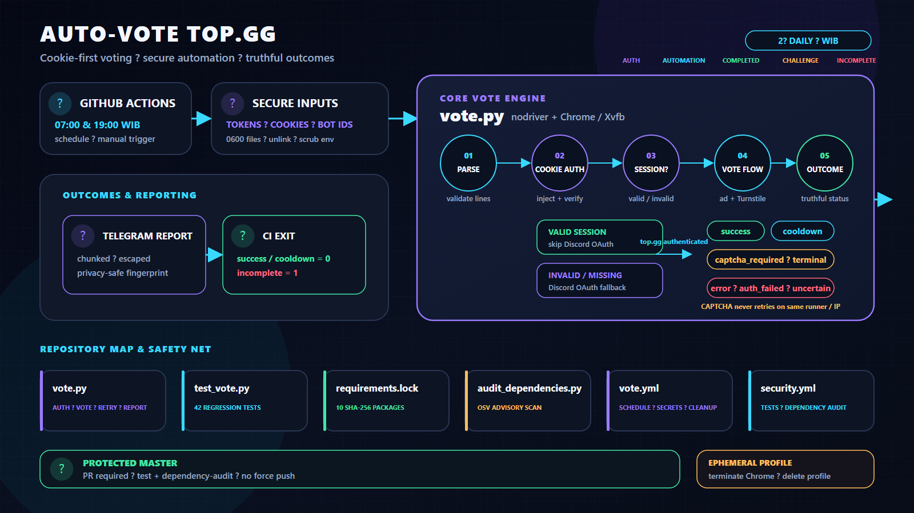

# auto-vote-topgg

Automated daily voting bot for [top.gg](https://top.gg) using nodriver (visible Chrome via Xvfb) + GitHub Actions. Supports multiple Discord accounts and multiple bots.

## Architecture at a Glance

[](assets/repo_infographic.svg)

> Cookie-first session verification leads into Discord OAuth fallback, terminal CAPTCHA handling, truthful CI outcomes, Telegram reporting, and isolated security controls. Click image for scalable SVG.

## Features

- 🗳️ Auto-vote **2× per day** (07:00 & 19:00 WIB) as a baseline/fallback
- ⏱️ **Cooldown-aware retry** — schedules the next workflow near top.gg eligibility
- 👥 **Multi-account** — vote with multiple Discord tokens and cookie sessions in one run
- 🤖 **Multi-bot** — vote for multiple bots per account
- 🍪 **Cookie-first auth** — injects only top.gg Auth.js cookies, then verifies the session
- 🔐 **OAuth fallback** — uses Discord OAuth when cookies are missing or expired
- ⚡ **Turnstile verification** — nodriver attempts Cloudflare checkbox verification
- 🔒 **Explicit CAPTCHA status** — interactive CAPTCHA is reported and not retried on the same runner
- 📨 **Telegram notifications** — chunked per-account reports with privacy-safe account fingerprints
- 🔁 **Scoped retry** — retries transient authentication and bot failures without repeating final results
- 📸 **Opt-in diagnostics** — optionally sends error/uncertain/CAPTCHA screenshots to a private Telegram chat
- 🚦 **Truthful CI status** — incomplete votes report to Telegram, then fail the workflow
- 🧹 **Auto-cleanup** — keeps the latest 10 GitHub Actions runs for debugging
- 📌 **Reproducible builds** — Python packages and GitHub Actions are pinned to tested immutable versions

## How It Works

```
TOPGG_COOKIES_JSON (same line order as TOKENS)
    ↓ inject top.gg Auth.js cookies
    ↓ verify /api/auth/session
    ├── valid → skip OAuth
    └── invalid/missing → Discord token injection → OAuth Authorize
top.gg authenticated
    ↓ navigate to vote page → wait ad → nodriver verify_cf()
    ├── interactive CAPTCHA → captcha_required (no retry this run)
    ├── cooldown text → bounded timestamp → temporary five-minute dispatcher
    └── verified → click Vote → confirm success/cooldown
```

## Setup

### 1. Fork this repository

Fork to your own GitHub account so you can add Secrets and run Actions.

### 2. Get your Discord Token

> [!CAUTION]
> Discord user tokens are sensitive credentials. Never share them.

**Via Network Tab (recommended):**
1. Open [discord.com](https://discord.com) in your browser → press `F12`
2. Go to **Network** tab → filter by **Fetch/XHR**
3. Click any channel or DM to trigger a request
4. Click any request to `discord.com/api/...`
5. In **Request Headers**, find the `Authorization` header → that's your token

**Via Local Storage:**
1. Open [discord.com](https://discord.com) → press `F12`
2. Go to **Application** tab → **Local Storage** → `https://discord.com`
3. Find key `token` → copy the value (without surrounding quotes)

### 3. Configure GitHub Secrets

Go to your repo **Settings → Secrets and variables → Actions → New repository secret**:

| Secret | Required | Description |
|--------|:--------:|-------------|
| `TOKENS` | ✅ | Discord user token(s) — one per line for multi-account |
| `BOT_IDS` | ❌ | Bot ID(s) to vote for — one per line. Default: `830530156048285716` |
| `TG_BOT_TOKEN` | ❌ | Telegram bot token (from [@BotFather](https://t.me/BotFather)) |
| `TG_CHAT_ID` | ❌ | Telegram chat/user ID for vote result notifications |
| `SEND_ERROR_SCREENSHOTS` | ❌ | Set to `1` to send error/uncertain/CAPTCHA screenshots to Telegram; default is disabled |
| `TOPGG_COOKIES_JSON` | ❌ | Full extension JSON export, one line per account matching `TOKENS` order |

At runtime, workflow copies credential secrets into mode-`0600` temporary files, unsets raw values, and passes only file paths to Python. Python reads and unlinks those files before Chrome starts. `BOT_IDS` and `SEND_ERROR_SCREENSHOTS` are non-credential configuration values and remain ordinary environment variables.

**`TOKENS` multi-account example:**
```
NzI4MjA0NDU4MjcxMjg2NzMy.XXXXXX.YYYYYYYYYYYY
OTQxNjM3NDU4MjcxMDA2NDAz.XXXXXX.ZZZZZZZZZZZZ
```

**`TOPGG_COOKIES_JSON` multi-account format:**

Install [Get cookies.txt LOCALLY](https://chromewebstore.google.com/detail/get-cookiestxt-locally/cclelndahbckbenkjhflpdbgdldlbecc) from Chrome Web Store first. Cookie export stays local to browser according to extension listing, but exported Auth.js session data remains a sensitive login credential.

1. Login to top.gg using account 1.
2. Open **Get cookies.txt LOCALLY** on a top.gg page.
3. Select export format **JSON**, then click **Copy**.
4. Paste the copied one-line JSON as line 1 in the secret.
5. Repeat using account 2 and paste as line 2.
6. Use `[]` for an account without exported cookies.

```text
[{"domain":".top.gg","name":"__Secure-authjs.session-token","value":"..."}, ...]
[{"domain":".top.gg","name":"__Secure-authjs.session-token","value":"..."}, ...]
[]
```

The script filters full export automatically and injects only cookie names containing `authjs` for `top.gg`. When this secret exists, its line count must exactly match `TOKENS`; use `[]` for any account without cookies. Before injection, every Auth.js cookie is forced to `Secure` and every session-token cookie is forced to `HttpOnly`, even when extension export omits or misreports those flags. Invalid/misaligned exports fail before browser startup without printing cookie values.

> [!CAUTION]
> Auth.js session cookies are login credentials. Store them only in GitHub Secrets; never commit or share them.

**`BOT_IDS` multi-bot example:**
```
830530156048285716
123456789012345678
```

### 4. Enable GitHub Actions

Go to your repo **Actions** tab → click **"I understand my workflows, go ahead and enable them"**.

## Automatic Schedule and Cooldown-Aware Retry

`vote.yml` still runs twice daily as a baseline:

- **07:00 WIB** (`00:00 UTC`)
- **19:00 WIB** (`12:00 UTC`)

When top.gg displays cooldown text such as:

```text
You can vote again in about 1 hour.
```

`vote.py` parses the duration, adds a five-minute safety buffer because `about` is approximate, and selects the earliest retry across all account/bot combinations. The workflow stores only this private one-day artifact:

```json
{"next_vote_at": 1786334400}
```

`cooldown-retry.yml` then activates temporarily and checks the timestamp every five minutes. Once due, it dispatches one `vote.yml` run and disables itself. Practical precision is roughly **target + 5–10 minutes**, plus possible GitHub Actions queue delay.

The artifact and dispatcher job contain no Discord token, top.gg cookie, Telegram token, account ID, or bot ID. Unparseable cooldown text creates no dynamic retry; 07:00/19:00 WIB remains the fallback. If a dynamic run is still early, the new cooldown is parsed and scheduled again.

### Fork & Scheduled Workflow Protection

GitHub automatically disables scheduled (`cron`) workflows in public repositories after **60 days of inactivity**, including forks.

To prevent this, the workflow includes a `workflow-keepalive` job that uses [`liskin/gh-workflow-keepalive@v1`](https://github.com/liskin/gh-workflow-keepalive). It refreshes the workflow schedule on every scheduled trigger.

If your workflow is ever disabled:
1. Go to **Actions → Top.gg Auto Vote → Enable workflow** (in the GitHub UI).
2. Make a dummy commit (`git commit --allow-empty -m "keepalive"`) to reset the 60-day timer.
3. Or trigger manually from time to time via **Actions → Top.gg Auto Vote → Run workflow**.

## Debugging

To enable verbose diagnostic logging locally, set `DEBUG=1`:

```bash
# Windows
set DEBUG=1 && python vote.py

# Linux / macOS
DEBUG=1 python vote.py
```

Error screenshots remain disabled unless `SEND_ERROR_SCREENSHOTS=1` is set.

For GitHub Actions diagnostics, add repository secret `SEND_ERROR_SCREENSHOTS=1`. Error, uncertain, and CAPTCHA states send screenshots to configured Telegram chat. Keep chat private: screenshots may contain Discord username, avatar, or top.gg account details. Without this secret, workflow screenshots remain disabled.

> [!WARNING]
> Use ephemeral, single-tenant GitHub-hosted runners only. Do not run this project on persistent/shared self-hosted runners: browser processes handle live account credentials and temporary profiles.

Transient authentication/browser failures retry up to 3 times. In multi-bot runs, only bots with `error` or `uncertain` results retry; `success`, `cooldown`, and `captcha_required` are final for the current run. Interactive CAPTCHA is intentionally not retried on the same runner/IP. Telegram reports identify accounts using a short SHA-256 fingerprint, never token fragments, and split automatically below Telegram's message limit.

- `success`, `cooldown`: final on the current runner/IP.
- A cooldown with a valid duration schedules an isolated dispatcher instead of sleeping/retrying on the same runner.
- `captcha_required`: final on the current runner/IP.
- `error`, `auth_failed`, `uncertain`: retry up to 3 times.

`error`, `auth_failed`, `uncertain`, or `captcha_required` sends its report first, then exits non-zero so GitHub Actions shows failure.

## Project Structure

```text
auto-vote-topgg/
├── vote.py                          # Auth, vote, cooldown state, report, browser lifecycle
├── test_vote.py                     # 51 unit/regression tests
├── audit_dependencies.py            # Stdlib OSV dependency audit
├── requirements.txt                 # Direct Python dependencies
├── requirements.lock                # Linux/Python 3.11 hashes and transitive pins
├── README.md                        # Setup and operating guide
├── SECURITY.md                      # Disclosure and credential policy
├── assets/
│   ├── repo_infographic.png         # README preview
│   └── repo_infographic.svg         # Scalable architecture source
├── .github/
│   ├── CODEOWNERS                   # Sensitive-file ownership
│   ├── dependabot.yml               # Weekly pip/Actions updates
│   └── workflows/
│       ├── security.yml             # Tests and dependency audit
│       ├── cooldown-retry.yml       # Temporary credential-free dispatcher
│       └── vote.yml                 # Schedule, secret handoff, vote, cleanup
└── .gitignore
```

## Requirements

- Python 3.11+
- `nodriver==0.50.3` + `requests==2.34.2` as direct dependencies
- Hash-locked Linux x86_64 / CPython 3.11 dependencies in `requirements.lock`
- Google Chrome/Chromium (discovered dynamically by workflow)
- Xvfb on headless Linux runners (installed by workflow)

### Local install

`requirements.lock` intentionally targets GitHub's Linux x86_64 / CPython 3.11 runner. For local development on Windows, macOS, or another Python ABI, install reviewed direct pins:

```bash
python -m pip install -r requirements.txt
```

### GitHub Actions install

CI verifies exact Linux wheels with:

```bash
python -m pip install --require-hashes -r requirements.lock
```

Run local checks:

```bash
python -m unittest -v
python -m py_compile vote.py test_vote.py audit_dependencies.py
python -m pip check
python audit_dependencies.py requirements.lock
```

Dependabot checks pip and GitHub Actions weekly. Regenerate lock by downloading CPython 3.11 Linux x86_64 wheels for `requirements.txt`, recording exact transitive versions, and adding each wheel SHA-256. Verify resulting install on GitHub Actions before merging.

`master` accepts changes through pull requests. Required `test` and `dependency-audit` checks must pass; branches must be current, conversations resolved, and history linear. Admins follow same policy. Force pushes and branch deletion are blocked. Human approvals remain `0` while repository has only one trusted collaborator.

## ⚠️ Disclaimer

This project automates interactions using Discord user tokens. Using self-bots violates [Discord's Terms of Service](https://discord.com/terms). Use at your own risk. The author is not responsible for any account bans or other consequences.
